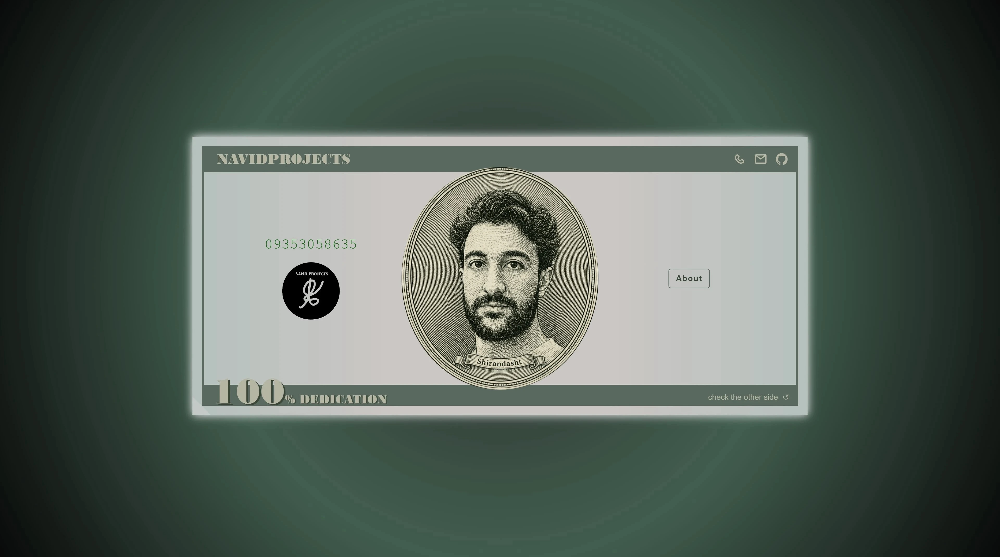

# NavidProjects

An interactive portfolio website inspired by the design and structure of a banknote.
The project presents personal information, skills, values, and contact details through a two-sided bill that can be flipped between a front and back face.

## Features

- Interactive card flip animation
- Fully responsive layout
- Custom SVG favicon
- About modal with smooth transitions
- Semantic HTML structure
- Optimized images for performance
- No frameworks or external libraries
- Mobile-friendly design

## Built With

- HTML5
- CSS3
- JavaScript (Vanilla)

## Design Goals

This project was created to explore:

- Responsive design
- CSS transforms and 3D effects
- UI storytelling
- Visual hierarchy
- Performance optimization
- Clean front-end architecture

## Author

Navid Shirandasht

Frontend development enthusiast with a background in Mechanical Engineering and a passion for creating meaningful digital experiences.

## Live Demo

Add your deployed website link here.

## License

This project is intended for portfolio and educational purposes.
